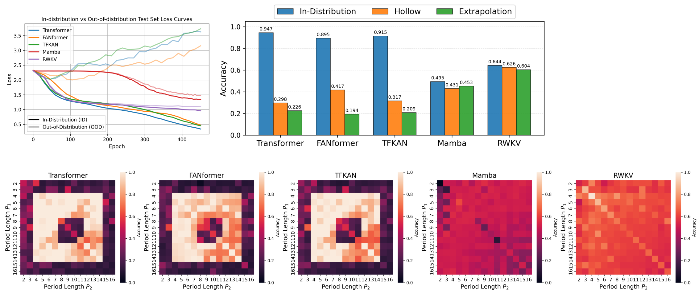
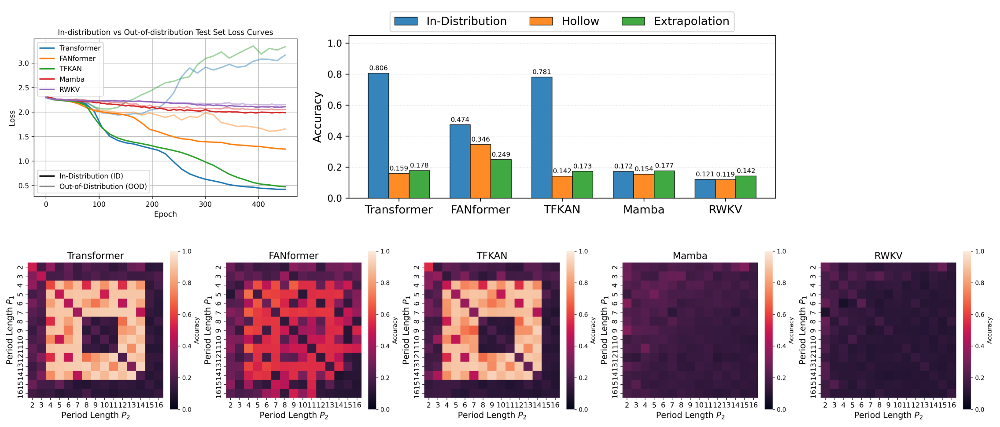
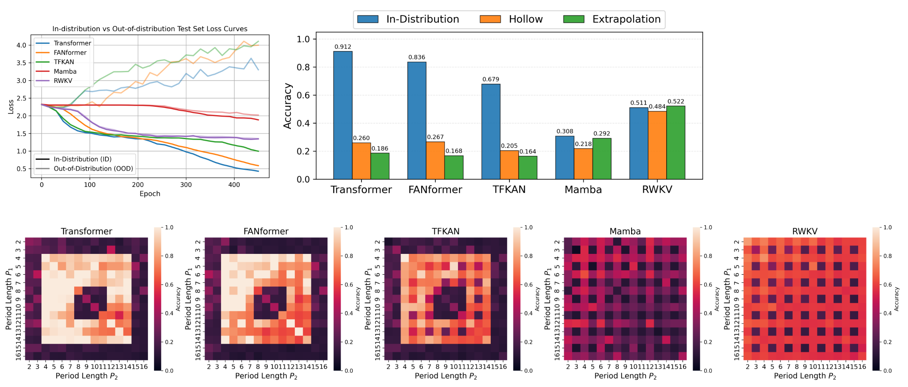

# Do Transformers Have the Ability for Periodicity Generalization?

Our work studies periodicity-based out-of-distribution generalization in large language models, we give the definition of periodicity from the perspective of group theory, and provide the Coper benchmark to reveal their failure to generalize unseen rule compositions

This repository contains the training and evaluation code of models on various composite periodic tasks
## 🚀Quick Start

(1) Install packages
```bash
pip install -r requirements.txt
```


(2) Start the training
```bash
bash run.sh
```
Edit the following variables in run.sh to configure

```bash
periodicType = ""
Layers = ""
modelName = ""
```

Edit the training hyperparameters in generate_periodic_data.py to configure

```bash
BATCHSIZE = ""
NUMEPOCH = ""
lr = ""
wd = ""
```


(3) Draw the result of one model
```bash
python draw.py
```

(4) Draw the results of all models
```bash
python draw_total.py
```
## 📄Results

**(1) Addition Task**




---

**(2) Convolution Task**



---

**(3) Hybrid Add Subtract Task**



## 🤝Acknowledge
This project reuses code from the following repositories:

* [Mamba](https://github.com/state-spaces/mamba)
* [RWKV](https://github.com/BlinkDL/RWKV-LM)
* [FANformer](https://github.com/YihongDong/FANformer)
* [TFKAN](https://github.com/LcWave/TFKAN)

## 📄 License

This repository includes components licensed under the Apache License 2.0.